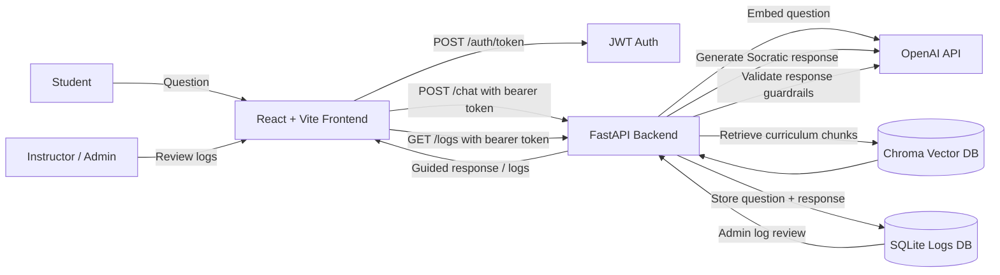
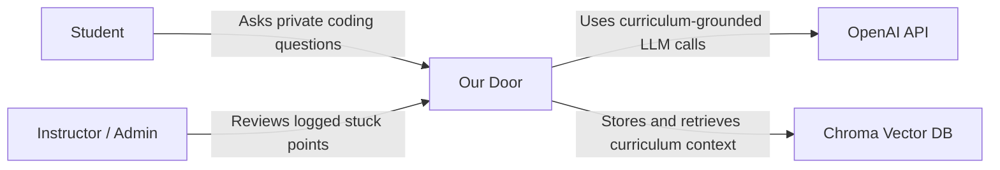
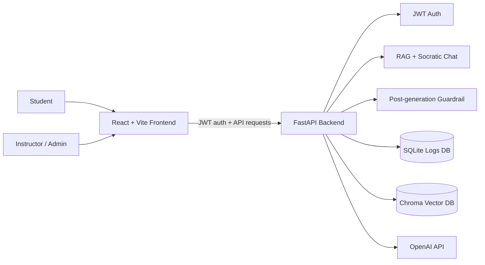
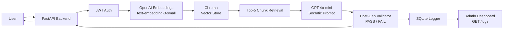

<h1 align="center">Team Three's Company: Our Door</h1>

<p align="center">
  <picture>
    
  </picture>
</p>

<p align="center">
  
  
  
  
  
  
  
  
</p>

**Our Door** is a Socratic learning chatbot for coding cohort programs. Students ask private coding questions and receive guided responses that help them think through problems themselves. Instructors get a dashboard view into what students are asking and where they are getting stuck.


---

## Table of Contents

- [Overview](#overview)
- [Problem](#problem)
- [Solution](#solution)
- [Pitch Deck](#pitch-deck)
- [How It Works](#how-it-works)
- [System Architecture](#system-architecture)
- [C4 Model](#c4-model)
- [Tech Stack](#tech-stack)
- [Project Structure](#project-structure)
- [Setup / Quick Start](#setup--quick-start)
- [Environment Variables](#environment-variables)
- [OpenAPI / API Documentation](#openapi--api-documentation)
- [Current MVP Status](#current-mvp-status)
- [Known Limitations](#known-limitations)
- [Future Improvements](#future-improvements)
- [Team](#team)
- [Program Attribution](#program-attribution)

---

## Overview

Our Door helps students in coding cohorts ask questions privately and get guidance that supports learning rather than direct answer-copying.

The core idea is the **Three Knocks** model:

1. **Hint** - a small nudge toward the concept.
2. **Curriculum reference** - a pointer back to relevant course material.
3. **Next step** - a concrete action that helps the student keep moving.

The goal is not to replace instructors or hand students final answers. The goal is to give students a safe place to get unstuck and give instructors better visibility into repeated confusion patterns.

## Problem

Coding cohorts move quickly. Students often work through dense materials, assignments, recordings, notes, and project requirements all at once.

When a student gets stuck, they may feel embarrassed to ask a question publicly. Instead, they might wait, Google the issue, ask a classmate, or use a general-purpose chatbot for a direct answer.

Those approaches can help in the moment, but they may not match the course curriculum or support long-term understanding.

## Solution

Our Door provides a private, curriculum-grounded chatbot experience for students and a log review flow for instructors/admins.

Students can ask coding questions without feeling exposed. The assistant responds Socratically through guided hints, curriculum references, and next steps.

Instructors/admins can review logged questions and responses to see where students are getting stuck and where support may be needed.

## Pitch Deck

The MVP pitch deck is available as a local HTML deck:

- [Live pitch deck](https://andreachurchwell.github.io/team1-aiseHackathon/)
- [Open the pitch deck](docs/mvp_pitch_deck/index.html)
- [Pitch script](docs/mvp_pitch_deck/pitch_script.md)

## How It Works

```txt
Student asks a question
  -> React frontend sends request
  -> FastAPI backend authenticates JWT
  -> Backend retrieves curriculum context from Chroma
  -> OpenAI generates a Socratic response
  -> Guardrail/post-generation validator checks the response
  -> Interaction is logged to SQLite
  -> Instructor/admin can review logged patterns
```

At a high level:

- The **React frontend** handles login, role-based views, student chat, and admin log review.
- The **FastAPI backend** exposes auth, chat, and logs endpoints.
- The **retrieval pipeline** uses Chroma to retrieve relevant curriculum context.
- The **LLM layer** uses OpenAI for Socratic response generation and validation.
- The **logging layer** stores conversation records in SQLite for admin review.

## System Architecture

> GitHub renders Mermaid diagrams automatically. If this diagram does not render in your local editor, try viewing the README on GitHub or install a Mermaid preview extension for VS Code.



Exported architecture diagram:


Major pieces:

- **React frontend:** student chat and admin dashboard UI.
- **FastAPI backend:** API layer for auth, chat, retrieval, validation, and logs.
- **Chroma vector database:** stores embedded curriculum chunks for retrieval.
- **SQLite logs database:** stores conversation logs for review.
- **OpenAI API:** powers embeddings, Socratic responses, and guardrail validation.
- **Admin dashboard:** lets instructors/admins review logged stuck points.

## C4 Model

> These Mermaid diagrams may require GitHub preview or a Mermaid-capable Markdown preview extension locally.

### Level 1: System Context



### Level 2: Container Diagram



## Tech Stack

| Area | Technology |
|---|---|
| Frontend | React, Vite, Axios |
| Backend | FastAPI, Python 3.11 |
| LLM | GPT-4o-mini via OpenAI API |
| Embeddings | text-embedding-3-small via OpenAI API |
| Vector DB | Chroma |
| Auth | JWT via python-jose, with two hardcoded MVP roles |
| Logging | SQLite |
| Containerization | Docker, Docker Compose |
| CI/CD | GitHub Actions |

## Project Structure

```txt
our-door/
|-- .github/                 # GitHub Actions workflows
|-- assets/
|   |-- diagrams/            # Architecture diagrams
|   |-- logos/               # Project/program logos
|   `-- screenshots/         # UI screenshots
|-- backend/                 # FastAPI app, RAG pipeline, guardrails, auth
|-- corpus/                  # Curriculum markdown files
|-- docs/                    # Scope docs, pitch deck, architecture notes
|-- frontend/                # React + Vite app
|-- ingest/                  # Corpus ingestion script
|-- docker-compose.yml
|-- OWNERSHIP.md
`-- README.md
```

## Setup / Quick Start

### Prerequisites

- Python 3.11+
- Node 18+
- Docker + Docker Compose, optional
- OpenAI API key

Platform notes:

- macOS/Linux examples use `source venv/bin/activate`.
- Windows Git Bash can also use `source venv/Scripts/activate`.
- Windows PowerShell/CMD can use `venv\Scripts\activate`.
- If PowerShell blocks `npm`, use `npm.cmd` instead, for example `npm.cmd run dev`.

### 1. Clone the Repository

```bash
git clone https://github.com/SamPomeroy/our-door
cd our-door
```

### 2. Create Backend Environment File

From the repo root:

macOS/Linux/Git Bash:

```bash
cp backend/.env.example backend/.env
```

Windows PowerShell:

```powershell
Copy-Item backend\.env.example backend\.env
```

Then add your OpenAI API key and secret key to `backend/.env`.

### 3. Install Backend Dependencies

From the repo root:

macOS/Linux:

```bash
cd backend
python -m venv venv
source venv/bin/activate
pip install -r requirements.txt
```

Windows Git Bash:

```bash
cd backend
python -m venv venv
source venv/Scripts/activate
pip install -r requirements.txt
```

Windows PowerShell:

```powershell
cd backend
python -m venv venv
venv\Scripts\activate
pip install -r requirements.txt
```

### 4. Run Corpus Ingestion

The ingestion script uses the same OpenAI and Chroma dependencies listed in `backend/requirements.txt`, so run it with the backend virtual environment active.

Make sure Chroma is running before ingestion. If using Docker for Chroma:

```bash
docker-compose up chromadb
```

Then, from the repo root:

```bash
python ingest/ingest.py
```

This loads curriculum content from `corpus/` into Chroma.

### 5. Start the Backend

From `backend/` with the virtual environment active:

```bash
uvicorn main:app --reload
```

Backend URLs:

- Backend: http://localhost:8000
- Swagger UI: http://localhost:8000/docs
- OpenAPI JSON: http://localhost:8000/openapi.json

### 6. Start the Frontend

In a separate terminal, from the repo root:

```bash
cd frontend
npm install
npm run dev
```

Windows PowerShell alternative:

```powershell
cd frontend
npm install
npm.cmd run dev
```

Frontend URL:

- App: http://localhost:5173

### Optional: Run with Docker

From the repo root:

macOS/Linux/Git Bash:

```bash
export OPENAI_API_KEY=your-openai-api-key
docker-compose up --build
```

Windows PowerShell:

```powershell
$env:OPENAI_API_KEY="your-openai-api-key"
docker-compose up --build
```

If your environment already has `OPENAI_API_KEY` set:

```bash
docker-compose up --build
```

Docker/database behavior may require local environment adjustment depending on your machine and Chroma setup.

## Environment Variables

Copy `backend/.env.example` to `backend/.env`.

Example `backend/.env.example`:

```env
OPENAI_API_KEY=your-openai-api-key
SECRET_KEY=replace-with-a-secure-dev-secret
# Optional for local development/demo stability:
MOCK_MODE=true
```

`OPENAI_API_KEY` is required for OpenAI LLM and embedding calls.

`SECRET_KEY` is used to sign JWTs for the MVP auth flow.

### Mock Mode

For development and demo purposes, the project supports a mock mode that allows the frontend and backend flow to run without making live OpenAI API calls.

This is useful for:

- Local UI development
- Demo stability
- Offline testing
- Reducing API usage during development

Example:

```env
MOCK_MODE=true
```

Mock mode is intended for local development and demos only.

Do not commit `.env` files.

## OpenAPI / API Documentation

FastAPI automatically generates API documentation when the backend is running.

- Swagger UI: http://localhost:8000/docs
- Raw OpenAPI JSON: http://localhost:8000/openapi.json

Endpoint summary:

| Method | Endpoint | Purpose |
|---|---|---|
| `POST` | `/auth/token` | Login with role/password and receive a JWT |
| `POST` | `/chat` | Send a student question and receive a Socratic response |
| `GET` | `/logs` | Retrieve logged conversations for admin review |

## Current MVP Status

MVP includes or is focused on:

- FastAPI backend structure
- RAG/retrieval pipeline
- OpenAI-powered Socratic responses
- Guardrail/post-generation validation
- Student-facing React frontend
- Admin dashboard/log review
- SQLite logging
- Two hardcoded MVP roles: student and admin

This is a capstone MVP, not a production deployment.

## Known Limitations

- Dev-only hardcoded roles and passwords.
- Auth is not production-ready.
- Curriculum corpus is limited to the current project materials.
- Retrieval quality depends on what has been ingested into Chroma.
- OpenAI API key is required for LLM and embedding calls.
- Admin analytics are MVP-level.
- The chatbot is intended to support learning, not replace instructor support.
- Docker/database setup may require local environment adjustment.

## Future Improvements

- Persistent user accounts.
- Stronger analytics and learning outcome tracking.
- Richer instructor dashboard.
- Expanded curriculum ingestion sources.
- Better evaluation metrics for response quality and learning support.
- Deployment hardening.
- Accessibility and UI polish.

## Team

| Member | Component |
|---|---|
| Sam | FastAPI backend, RAG pipeline, guardrail system |
| Ricky | Data ingestion, corpus pipeline, CI/CD |
| Andrea | React frontend, admin dashboard, documentation |

## Dev Credentials

For local development only:

- Student password: `learn2024`
- Admin password: `teach2024`

---

## Architecture



---

## MVP Scope

See [docs/SCOPE.md](docs/SCOPE.md).

## Program Attribution

Built for AISE 26 Capstone | Columbia University 

<p align="center">
  
</p>
