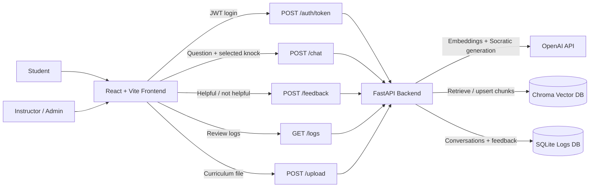
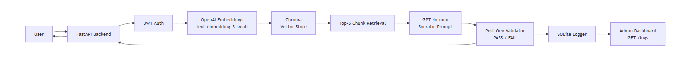
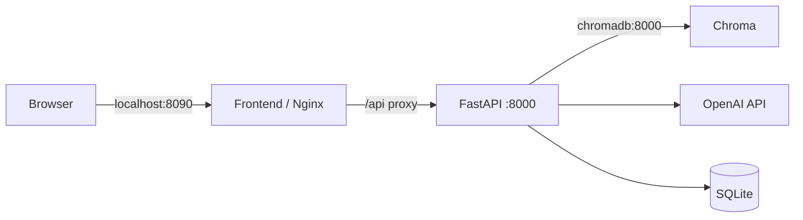
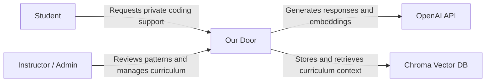
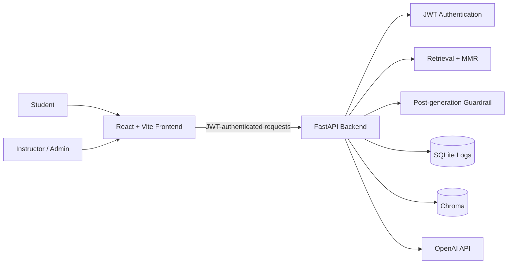

<h1 align="center">Team Three's Company: Our Door</h1>

<p align="center">
  <picture>
    
  </picture>
</p>

<p align="center">
  
  
  
  
  
  
  
  
  
  
  
</p>

**Our Door** is a private, curriculum-grounded Socratic learning assistant for coding cohorts. Students choose the kind of help they need without being handed a direct solution, while instructors can review conversation patterns, feedback, and curriculum coverage from an admin dashboard.

<p align="center">
  <strong><a href="https://ourdoor.sampom.me/">Open the deployed application</a></strong>
</p>

---

## Table of Contents

- [Overview](#overview)
- [Problem](#problem)
- [Solution](#solution)
- [Features](#features)
- [Live Application](#live-application)
- [Pitch Deck](#pitch-deck)
- [How It Works](#how-it-works)
- [System Architecture](#system-architecture)
- [C4 Model](#c4-model)
- [Tech Stack](#tech-stack)
- [Project Structure](#project-structure)
- [Setup / Quick Start](#setup--quick-start)
- [Troubleshooting](#troubleshooting)
- [Environment Variables](#environment-variables)
- [API Reference](#api-reference)
- [Testing](#testing)
- [Current Status and Limitations](#current-status-and-limitations)
- [Future Improvements](#future-improvements)
- [Dev Credentials](#dev-credentials)
- [Team](#team)
- [Project Documentation](#project-documentation)
- [Program Attribution](#program-attribution)

---

## Overview

Coding cohorts move quickly, and students do not always feel comfortable asking a question publicly. General-purpose chatbots can provide a fast answer, but that answer may bypass the learning process or ignore the course curriculum.

Our Door gives students a private place to get unstuck through the **Three Knocks** model. For every question, the student explicitly chooses one response type:

1. **Hint** - one short guiding question that nudges toward the relevant concept.
2. **Curriculum Reference** - a pointer back to a topic or pattern from the course material.
3. **Next Step** - one concrete action the student can take immediately.

The goal is not to replace instructors or provide final answers. It is to preserve productive struggle, ground support in the curriculum, and surface repeated areas of confusion to instructors.

## Problem

Coding cohorts move quickly. Students often work through dense course materials, assignments, recordings, notes, and project requirements at the same time. When they get stuck, asking for help can feel public or disruptive, especially when they believe everyone else is keeping up.

Students may wait too long, search outside the curriculum, ask a classmate, or use a general-purpose chatbot that provides a complete answer. Those options can resolve the immediate blocker, but they may skip the reasoning practice the course is designed to develop.

Instructors face the other side of the same problem: individual questions are scattered across conversations, office hours, and private messages. Without a shared view of recurring topics and response quality, it is difficult to see where the cohort needs additional support.

## Solution

Our Door combines a private student support experience with an instructor review workspace.

Students submit a coding question and select the kind of guidance they need. The backend retrieves relevant curriculum context, generates a response constrained to the selected knock, and applies a second guardrail check before returning it. Students can then rate the response as helpful or not helpful.

Instructors can review conversations, filter logs, inspect feedback and knock types, identify repeated questions, and upload new curriculum without changing the codebase. This creates a feedback loop between student needs, curriculum coverage, and instructor intervention.

## Features

### Student Experience

- Private student/admin login flow using JWT bearer tokens.
- Student-selected Hint, Curriculum Reference, or Next Step for each question.
- Curriculum-grounded retrieval from Chroma before response generation.
- Post-generation guardrail that checks for direct answers and retries with a stricter Socratic prompt when needed.
- Thumbs-up and thumbs-down feedback saved against each response.
- Prompt suggestions, keyboard submission, loading states, and error handling.
- Interactive 3D door built with React Three Fiber and Three.js.
- Door transitions for login and sign-out.
- Light and dark themes.

### Instructor Experience

- Admin dashboard with conversation logs and expandable question/response details.
- Search plus topic and inferred-severity filters.
- Feedback status, selected knock type, and review signals on each log.
- Dashboard views for topic volume, usage, knock usage, confusion patterns, repeated questions, and activity.
- Curriculum upload from the admin sidebar.
- Supported upload types: `.md`, `.txt`, `.pdf`, `.docx`, and `.csv`.
- Uploaded files are parsed, chunked, embedded, and upserted into the Chroma `curriculum` collection.

### Demo and Operations

- Demo landing view with Student, Admin, and Slides navigation.
- In-app video slide presentation.
- Public deployment at [ourdoor.sampom.me](https://ourdoor.sampom.me/).
- Mock mode for stable UI demos and automated tests without OpenAI calls.
- Docker Compose services for the frontend, backend, and Chroma.
- GitHub Actions lint and backend test workflow.
- FastAPI Swagger and OpenAPI documentation.

## Live Application

The deployed application is available at:

**https://ourdoor.sampom.me/**

Use the development credentials below to enter the student or admin experience. The deployment depends on its hosted backend, Chroma service, and configured environment variables.

## Pitch Deck

- [Live pitch deck](https://andreachurchwell.github.io/team1-aiseHackathon/)
- [MVP pitch deck](docs/mvp_pitch_deck/index.html)
- [MVP pitch script](docs/mvp_pitch_deck/pitch_script.md)
- [Demo pitch deck](docs/demo_pitch_deck/index.html)

## How It Works

```txt
Student chooses a knock and asks a question
  -> React sends the question, knock type, and JWT
  -> FastAPI embeds the question
  -> Chroma returns relevant curriculum chunks
  -> MMR reranking selects diverse context
  -> OpenAI generates the requested Socratic response type
  -> A second guardrail check rejects direct-answer responses
  -> The interaction is stored in SQLite
  -> The student can submit helpful/not-helpful feedback
  -> The admin dashboard surfaces logs and aggregate signals
```

Curriculum can enter Chroma in two ways:

- Run `ingest/ingest.py` to load the repository's starter Markdown corpus.
- Upload a supported file from the admin dashboard to parse, chunk, embed, and store it immediately.

## System Architecture



Exported architecture diagram:



### Runtime Containers



For local development, the backend defaults to Chroma at `localhost:8001`. In Docker Compose, `CHROMA_HOST=chromadb` and `CHROMA_PORT=8000` are set for container-to-container communication.

### Architecture Components

- **React frontend:** role-based login, student chat, admin analytics, curriculum upload, demo navigation, slides, themes, and 3D door interactions.
- **FastAPI backend:** authentication, chat orchestration, feedback, logs, file parsing, curriculum ingestion, and API documentation.
- **OpenAI API:** curriculum embeddings, Socratic response generation, and post-generation guardrail classification.
- **Chroma:** persistent vector storage and curriculum retrieval.
- **MMR reranking:** selects a more diverse set of retrieved curriculum chunks before generation.
- **SQLite:** stores conversation logs, selected knock types, timestamps, topics, and feedback.
- **Nginx:** serves the production frontend image and proxies `/api` requests to FastAPI in Docker.

## C4 Model

### Level 1: System Context



### Level 2: Container View



## Tech Stack

| Area | Technology |
|---|---|
| Frontend | React 19, Vite 8, Axios |
| 3D UI | React Three Fiber, Three.js |
| Backend | FastAPI, Python 3.11 |
| LLM | `gpt-4o-mini` via OpenAI API |
| Embeddings | `text-embedding-3-small` via OpenAI API |
| Retrieval | Chroma with MMR reranking |
| File parsing | PyPDF, python-docx, Python CSV/text parsing |
| Authentication | JWT via `python-jose`; student and admin MVP roles |
| Logging | SQLite |
| Serving | Nginx for the production frontend image |
| Containerization | Docker, Docker Compose |
| CI | GitHub Actions, Flake8, Pytest |

## Project Structure

```txt
our-door/
|-- .github/
|   `-- workflows/ci.yml             # Python lint and backend tests
|-- assets/
|   |-- diagrams/                    # Architecture diagram
|   `-- logos/                       # Project and program logos
|-- backend/
|   |-- tests/                       # Unit, API, prompt, and integration tests
|   |-- auth.py                      # JWT roles and token endpoint
|   |-- main.py                      # Chat, feedback, logs, upload, RAG, guardrails
|   |-- Dockerfile
|   `-- requirements.txt
|-- corpus/                          # Starter curriculum Markdown files
|-- docs/                            # Scope, testing, architecture, and pitch decks
|-- frontend/
|   |-- public/slides/               # Demo slide videos
|   |-- src/
|   |   |-- components/
|   |   |   |-- admin/               # Analytics, logs, and upload components
|   |   |   |-- DemoNav.jsx
|   |   |   `-- DoorScene.jsx        # React Three Fiber door
|   |   |-- data/adminAnalytics.js
|   |   |-- pages/                   # Login, student, admin, demo, slides
|   |   |-- api.js                   # Axios API client
|   |   |-- App.jsx
|   |   `-- App.css
|   |-- Dockerfile
|   |-- nginx.conf
|   `-- package.json
|-- ingest/
|   `-- ingest.py                    # Starter corpus ingestion
|-- docker-compose.yml
|-- OWNERSHIP.md
`-- README.md
```

## Setup / Quick Start

### Prerequisites

- Python 3.11+
- Node.js 20+ recommended
- Docker Desktop with Docker Compose for Chroma or the full stack
- OpenAI API key for live embeddings and responses

Windows notes:

- Git Bash can activate the backend environment with `source venv/Scripts/activate`.
- PowerShell can use `venv\Scripts\activate`.
- If PowerShell blocks the `npm.ps1` shim, use `npm.cmd`.

### 1. Clone and Configure

```bash
git clone https://github.com/SamPomeroy/our-door
cd our-door
```

Create the backend environment file:

```bash
cp backend/.env.example backend/.env
```

PowerShell:

```powershell
Copy-Item backend\.env.example backend\.env
```

Add your OpenAI API key and a development secret to `backend/.env`.

### 2. Install Backend Dependencies

macOS/Linux:

```bash
cd backend
python -m venv venv
source venv/bin/activate
pip install -r requirements.txt
cd ..
```

Windows Git Bash:

```bash
cd backend
python -m venv venv
source venv/Scripts/activate
pip install -r requirements.txt
cd ..
```

Windows PowerShell:

```powershell
cd backend
python -m venv venv
venv\Scripts\activate
pip install -r requirements.txt
cd ..
```

### 3. Start Chroma

Start Docker Desktop, then run from the repository root:

```bash
docker compose up -d chromadb
docker compose ps
```

Chroma is exposed to the host at `http://localhost:8001`.

### 4. Load the Starter Corpus

With Chroma running, execute the ingestion script from the repository root using the backend environment:

macOS/Linux:

```bash
backend/venv/bin/python ingest/ingest.py
```

Windows:

```powershell
backend\venv\Scripts\python.exe ingest\ingest.py
```

This step seeds the Markdown files in `corpus/`. It is optional if curriculum will be added through the admin upload UI instead.

### 5. Start the Backend

From `backend/` with the virtual environment active:

```bash
python -m uvicorn main:app --reload
```

- API: http://localhost:8000
- Swagger UI: http://localhost:8000/docs
- OpenAPI JSON: http://localhost:8000/openapi.json

### 6. Start the Frontend

In another terminal:

```bash
cd frontend
npm install
npm run dev
```

PowerShell:

```powershell
cd frontend
npm install
npm.cmd run dev
```

The local frontend runs at http://localhost:5173 and calls the API at `http://localhost:8000` by default.

### Full Docker Stack

With Docker Desktop running and `backend/.env` configured:

```bash
docker compose up --build -d
docker compose ps
```

- Frontend: http://localhost:8090
- Backend: http://localhost:8000
- Chroma host port: http://localhost:8001

Stop the stack with:

```bash
docker compose down
```

Use `docker compose down -v` only when you intentionally want to delete the persisted Chroma volume.

## Troubleshooting

### Docker Cannot Connect to the Linux Engine

An error referencing `dockerDesktopLinuxEngine` usually means Docker Desktop is installed but its Linux engine is not running. Open or restart Docker Desktop, wait for it to report that the engine is ready, and retry:

```bash
docker compose up -d chromadb
docker compose ps
```

The Compose warning that the top-level `version` attribute is obsolete is informational and does not prevent startup.

### Missing PDF or Word Parser

If the backend reports `No module named 'pypdf'` or `No module named 'docx'`, install the committed requirements into the same virtual environment used to launch Uvicorn:

```bash
cd backend
python -m pip install -r requirements.txt
python -m uvicorn main:app --reload
```

Using `python -m uvicorn` helps ensure Uvicorn runs from the active environment.

### Curriculum Upload Fails

Confirm all of the following:

- The user is logged in with the admin role.
- Chroma is running and reachable.
- The file extension is `.md`, `.txt`, `.pdf`, `.docx`, or `.csv`.
- `OPENAI_API_KEY` is valid when `MOCK_MODE=false`.
- Local development uses Chroma at `localhost:8001`.
- Docker uses `CHROMA_HOST=chromadb` and `CHROMA_PORT=8000`.

The upload endpoint returns backend validation details when available. Swagger at http://localhost:8000/docs can be used to test the endpoint independently of the frontend.

### PowerShell Blocks npm

If PowerShell refuses to load `npm.ps1`, use the Windows command shim:

```powershell
npm.cmd run dev
npm.cmd run build
```

## Environment Variables

`backend/.env`:

```env
OPENAI_API_KEY=your-key-here
SECRET_KEY=replace-with-a-secure-dev-secret
MOCK_MODE=false
```

| Variable | Default | Purpose |
|---|---|---|
| `OPENAI_API_KEY` | Empty | Required for live OpenAI embeddings and responses |
| `SECRET_KEY` | Development fallback in code | Signs JWTs; set a unique value outside local demos |
| `MOCK_MODE` | `false` | Uses deterministic local embeddings and mock responses when `true` |
| `CHROMA_HOST` | `localhost` | Chroma hostname; Docker Compose sets `chromadb` |
| `CHROMA_PORT` | `8001` | Chroma port; Docker Compose sets container port `8000` |
| `VITE_API_URL` | `http://localhost:8000` | Frontend API base URL; Docker build sets `/api` |

Do not commit `.env` files.

### Mock Mode

Set `MOCK_MODE=true` for UI development, demos, or automated tests that should not make OpenAI calls:

```env
MOCK_MODE=true
```

Mock mode does not remove the Chroma dependency from curriculum uploads. Uploads still need a running Chroma service because the endpoint upserts the generated chunks.

## API Reference

Authenticated endpoints expect:

```http
Authorization: Bearer <token>
```

| Method | Endpoint | Access | Purpose |
|---|---|---|---|
| `POST` | `/auth/token` | Public | Exchange role/password for a JWT |
| `POST` | `/chat` | Authenticated | Send a question and selected `knock_type` |
| `POST` | `/feedback` | Authenticated | Save helpful/not-helpful feedback for a log |
| `GET` | `/logs` | Admin | Retrieve conversation and feedback logs |
| `POST` | `/upload` | Admin | Upload curriculum as multipart form data under key `file` |

Example chat body:

```json
{
  "message": "Why does Python scope work this way?",
  "knock_type": "curriculum"
}
```

Valid `knock_type` values are `hint`, `curriculum`, and `next_step`.

Successful upload response:

```json
{
  "filename": "course-notes.pdf",
  "chunks_added": 42
}
```

## Testing

Backend tests:

```bash
cd backend
python -m pip install pytest httpx
python -m pytest tests/ -v --ignore=tests/test_integration.py
```

Live integration tests require the running stack and a valid OpenAI API key:

```bash
cd backend
python -m pytest tests/test_integration.py -v
```

Frontend production build:

```bash
cd frontend
npm run build
```

See [docs/TESTING.md](docs/TESTING.md) for the external tester workflow and API smoke tests.

## Current Status and Limitations

Our Door currently includes the Phase 2 curriculum upload, student-selected response type, feedback, MMR retrieval, analytics UI, and demo presentation work. The core student, instructor, retrieval, upload, and feedback flows are implemented.

It remains a capstone MVP rather than a production deployment:

- Student and admin credentials are hardcoded for development.
- There are no individual user accounts, cohorts, or persistent student histories.
- JWT storage and authentication are not production hardened.
- SQLite and local Chroma persistence are intended for a small demo environment.
- Admin severity, student labels, and several aggregate analytics are inferred or presentation-oriented rather than a complete learning analytics system.
- Mock mode uses zero-vector embeddings and canned responses.
- Live response and upload embedding paths require OpenAI API access.
- Upload success requires Chroma to be running and reachable.
- The assistant supports learning but does not replace instructor review.

## Future Improvements

- Replace hardcoded development roles with persistent user accounts and secure credential management.
- Add multi-cohort support, instructor-managed courses, and student-specific history.
- Move production data from local SQLite and Chroma volumes to managed persistent services.
- Add file-size limits, upload progress, duplicate-source handling, and curriculum management controls.
- Expand evaluation beyond thumbs feedback with retrieval quality, guardrail, and learning-support metrics.
- Replace presentation-oriented inferred analytics with validated cohort and learning outcome measures.
- Add source citations to student responses and richer curriculum metadata.
- Improve accessibility testing, responsive behavior, and reduced-motion support.
- Add frontend tests and broaden CI coverage across the full stack.
- Harden deployment configuration, observability, secrets management, and rate limiting.

## Dev Credentials

For local development only:

- Student password: `learn2024`
- Admin password: `teach2024`

## Team

| Member | Component |
|---|---|
| Sam | FastAPI backend, RAG pipeline, guardrail system |
| Ricky | Data ingestion, corpus pipeline, CI/CD |
| Andrea | React frontend, 3D experience, admin dashboard, documentation |

## Project Documentation

- [MVP scope](docs/SCOPE.md)
- [Phase 2 plan](docs/PHASE2.md)
- [Testing guide](docs/TESTING.md)
- [Ownership](OWNERSHIP.md)

## Program Attribution

Built for AISE 26 Capstone | Columbia University

<p align="center">
  
</p>
