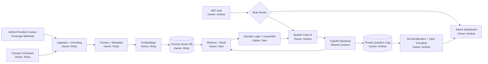

# Architecture Sketch

## High-Level Design

## Frontend
- Technology: React.
- Key screens: student chat, login/role routing, admin log view.
- Responsibilities: send chat requests, display guided responses, write private logs, display de-identified admin patterns, route users by role.
- Justification: brief-preferred choice; supports two distinct views with role-based routing.

## Backend
- Technology: FastAPI.
- Key endpoints:
  - `POST /auth/login`
  - `POST /chat`
  - `GET /admin/logs`
  - `GET /health`
- Responsibilities: auth contract, RAG orchestration, logging, admin data access.
- Justification: explicitly recommended in the brief; auto-generates API docs; fast to build and maintain.
- Auth: JWT via `python-jose` for lightweight two-role auth: student and admin.

## RAG + Guardrails
- LLM: GPT-4o-mini through the OpenAI API.
- LLM justification: cost-justified at under $5/month for 20 students; API tier data is not used for model training, satisfying privacy requirements without self-hosting overhead.
- Embeddings: `text-embedding-3-small`.
- Embedding justification: same provider as LLM, consistent pipeline, one-time corpus embedding cost under $0.01.
- Query gets embedded.
- Chroma returns top-k curriculum chunks.
- Retrieved chunks are ranked before generation.
- System prompt produces Socratic guidance.
- Post-generation validator checks for final-answer leakage and off-curriculum responses.

## Ingestion Pipeline
- Reads Canvas curriculum exports/materials for the demo corpus.
- Accepts admin-provided course coverage materials through the backend ingestion path.
- Chunks by section or paragraph.
- Embeds chunks with `text-embedding-3-small`.
- Loads chunks and metadata into Chroma.
- Handles malformed files gracefully by logging and skipping.

## Data Layer
- Chroma for vector search over curriculum chunks.
- Chroma justification: free, open source, Python-native, runs locally via Docker, no external service dependency, appropriate for 20 students and 100 documents.
- SQLite for Phase 1 logging.
- SQLite justification: zero infrastructure, single file, no setup; straightforward upgrade to Postgres in Phase 2.
- Private log fields: user ID, question, timestamp, role, retrieved source metadata, privacy flag, and response summary.
- Admin-visible fields: de-identified question/theme, timestamp or time window, topic/source metadata, and frequency.

## DevOps
- Containerization: Docker + Docker Compose.
- Containerization justification: FastAPI and Chroma run together in one compose file; one command spins up the full system.
- CI/CD: GitHub Actions.
- CI/CD justification: lint and test on push, satisfying the brief's automation requirement.

## Demo Path
1. Ingest a small set of representative curriculum files.
2. Student asks a stuck-point question.
3. Backend retrieves relevant content and responds Socratically.
4. Admin opens dashboard and sees de-identified question patterns and repeated stuck points.
